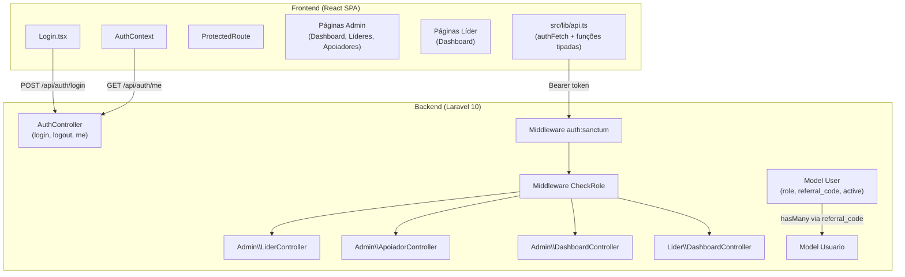
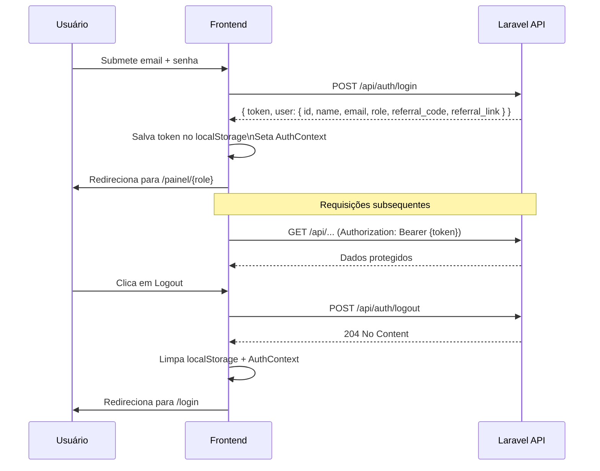
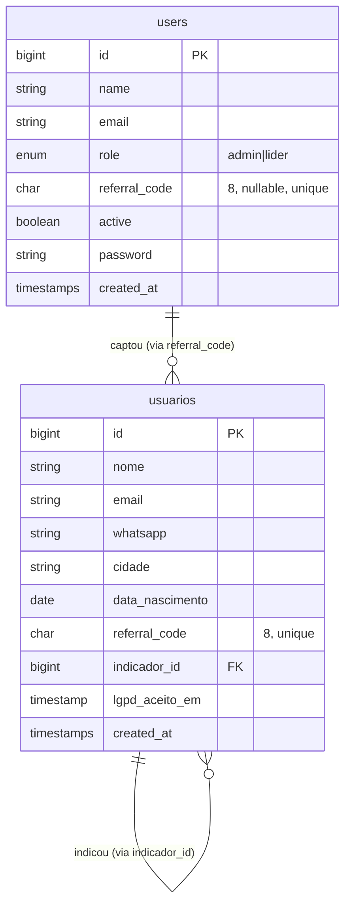

# Documento de Design Técnico — Admin Panel

## Visão Geral

O painel administrativo adiciona autenticação baseada em roles ao sistema de cadastro de apoiadores. Dois perfis coexistem na tabela `users` do Laravel: **Admin** (acesso total) e **Líder** (acesso restrito às próprias métricas). A autenticação usa Laravel Sanctum com tokens Bearer. O frontend é uma SPA React/TypeScript com rotas protegidas por perfil, integrada ao ApiClient existente.

---

## Arquitetura



### Fluxo de Autenticação



---

## Componentes e Interfaces

### Backend — Estrutura de Arquivos

```
app/
  Http/
    Controllers/
      AuthController.php
      Admin/
        LiderController.php
        ApoiadorController.php
        DashboardController.php
      Lider/
        DashboardController.php
    Middleware/
      CheckRole.php
    Requests/
      Auth/
        LoginRequest.php
      Admin/
        StoreLiderRequest.php
        UpdateLiderRequest.php
  Models/
    User.php          # estendido com role, referral_code, active
database/
  migrations/
    xxxx_add_role_referral_active_to_users_table.php
  seeders/
    AdminSeeder.php
```

### Assinaturas PHP — Controllers

```php
// AuthController
class AuthController extends Controller
{
    public function login(LoginRequest $request): JsonResponse;
    public function logout(Request $request): JsonResponse;
    public function me(Request $request): JsonResponse;
}

// Admin\LiderController
class LiderController extends Controller
{
    public function index(Request $request): JsonResponse;   // paginado, ?search
    public function store(StoreLiderRequest $request): JsonResponse;
    public function update(UpdateLiderRequest $request, int $id): JsonResponse;
    public function toggle(int $id): JsonResponse;
}

// Admin\ApoiadorController
class ApoiadorController extends Controller
{
    public function index(Request $request): JsonResponse;   // paginado, ?search
}

// Admin\DashboardController
class DashboardController extends Controller
{
    public function index(): JsonResponse;
}

// Lider\DashboardController
class DashboardController extends Controller
{
    public function index(Request $request): JsonResponse;
}
```

### Assinatura PHP — Middleware CheckRole

```php
// App\Http\Middleware\CheckRole
class CheckRole
{
    public function handle(Request $request, Closure $next, string ...$roles): Response
    {
        if (! in_array($request->user()?->role, $roles, true)) {
            return response()->json(['message' => 'Forbidden'], 403);
        }
        return $next($request);
    }
}
```

### Frontend — Estrutura de Arquivos

```
src/
  contexts/
    AuthContext.tsx
  hooks/
    useAuth.ts
    useAdminDashboard.ts
    useLiderDashboard.ts
    useLideres.ts
    useApoiadores.ts
  pages/
    Login.tsx
    painel/
      Index.tsx           # redirect por role
      admin/
        Dashboard.tsx
        Lideres.tsx
        Apoiadores.tsx
      lider/
        Dashboard.tsx
  components/
    painel/
      ProtectedRoute.tsx
      PainelLayout.tsx
```

### Interfaces TypeScript

```typescript
// AuthContext
export type UserRole = 'admin' | 'lider';

export interface AuthUser {
  id: number;
  name: string;
  email: string;
  role: UserRole;
  referral_code: string | null;
  referral_link: string | null;
}

export interface AuthContextValue {
  token: string | null;
  user: AuthUser | null;
  isLoading: boolean;
  login: (email: string, password: string) => Promise<void>;
  logout: () => Promise<void>;
}

// API — Líderes
export interface LiderItem {
  id: number;
  name: string;
  email: string;
  referral_code: string;
  referral_link: string;
  active: boolean;
  created_at: string;
  total_indicados: number;
}

export interface PaginatedResponse<T> {
  data: T[];
  current_page: number;
  last_page: number;
  per_page: number;
  total: number;
}

// API — Apoiadores
export interface ApoiadorItem {
  id: number;
  nome: string;
  email: string;
  whatsapp: string;
  cidade: string;
  data_nascimento: string;
  referral_code: string;
  created_at: string;
  indicador_nome: string | null;
}

// API — Dashboard Admin
export interface AdminDashboardData {
  total_apoiadores: number;
  total_lideres: number;
  cadastros_por_dia: Array<{ data: string; quantidade: number }>;
}

// API — Dashboard Líder
export interface LiderDashboardData {
  total_indicados: number;
  cadastros_por_dia: Array<{ data: string; quantidade: number }>;
}

// API — Parâmetros de listagem
export interface ListParams {
  page?: number;
  per_page?: number;
  search?: string;
}
```

### Assinaturas TypeScript — ApiClient (extensão de api.ts)

```typescript
// Autenticação
export async function login(email: string, password: string): Promise<LoginResponse>;
export async function logout(token: string): Promise<void>;
export async function getMe(token: string): Promise<AuthUser>;

// Admin — Líderes
export async function getLideres(token: string, params?: ListParams): Promise<PaginatedResponse<LiderItem>>;
export async function createLider(token: string, data: CreateLiderPayload): Promise<LiderItem>;
export async function updateLider(token: string, id: number, data: UpdateLiderPayload): Promise<LiderItem>;
export async function toggleLider(token: string, id: number): Promise<LiderItem>;

// Admin — Apoiadores
export async function getApoiadores(token: string, params?: ListParams): Promise<PaginatedResponse<ApoiadorItem>>;

// Dashboards
export async function getAdminDashboard(token: string): Promise<AdminDashboardData>;
export async function getLiderDashboard(token: string): Promise<LiderDashboardData>;
```

---

## Modelos de Dados

### Migration — Extensão da tabela `users`

```php
Schema::table('users', function (Blueprint $table) {
    $table->enum('role', ['admin', 'lider'])->default('lider')->after('email');
    $table->char('referral_code', 8)->nullable()->unique()->after('role');
    $table->boolean('active')->default(true)->after('referral_code');
});
```

### Modelo User — Extensões

```php
class User extends Authenticatable
{
    use HasApiTokens, HasFactory, Notifiable;

    protected $fillable = ['name', 'email', 'password', 'role', 'referral_code', 'active'];
    protected $hidden   = ['password', 'remember_token'];
    protected $casts    = ['email_verified_at' => 'datetime', 'active' => 'boolean'];
    protected $appends  = ['referral_link'];

    public function getReferralLinkAttribute(): ?string
    {
        if (! $this->referral_code) return null;
        return config('app.url') . '/cadastro?ref=' . $this->referral_code;
    }

    /** Apoiadores captados por este líder (join via referral_code). */
    public function indicados(): HasMany
    {
        return $this->hasMany(Usuario::class, 'referral_code', 'referral_code');
    }
}
```

### Rotas da API

```
POST   /api/auth/login
POST   /api/auth/logout                    [auth:sanctum]
GET    /api/auth/me                        [auth:sanctum]

GET    /api/admin/lideres                  [auth:sanctum, role:admin]
POST   /api/admin/lideres                  [auth:sanctum, role:admin]
PUT    /api/admin/lideres/{id}             [auth:sanctum, role:admin]
PATCH  /api/admin/lideres/{id}/toggle      [auth:sanctum, role:admin]

GET    /api/admin/apoiadores               [auth:sanctum, role:admin]
GET    /api/admin/dashboard                [auth:sanctum, role:admin]

GET    /api/lider/dashboard                [auth:sanctum, role:lider]
```

### Seeder de Admin

```php
// database/seeders/AdminSeeder.php
User::create([
    'name'     => 'Administrador',
    'email'    => 'admin@aliancavitoria300.com.br',
    'password' => Hash::make(env('ADMIN_PASSWORD', 'changeme')),
    'role'     => 'admin',
    'active'   => true,
]);
```

### Diagrama Entidade-Relacionamento



---

## Propriedades de Correção

*Uma propriedade é uma característica ou comportamento que deve ser verdadeiro em todas as execuções válidas de um sistema — essencialmente, uma declaração formal sobre o que o sistema deve fazer. Propriedades servem como ponte entre especificações legíveis por humanos e garantias de correção verificáveis por máquina.*

### Propriedade 1: Round-trip de autenticação

*Para qualquer* usuário com role `admin` ou `lider` e credenciais válidas, o token retornado pelo `POST /api/auth/login` deve ser aceito pelo `GET /api/auth/me`, que deve retornar o mesmo `id`, `email` e `role` do usuário que fez login.

**Valida: Requisitos 1.1, 1.9**

---

### Propriedade 2: Credenciais inválidas nunca retornam token

*Para qualquer* combinação de email e senha que não corresponda a um usuário ativo no sistema, o endpoint `POST /api/auth/login` deve retornar HTTP 401 e o corpo da resposta não deve conter o campo `token`.

**Valida: Requisito 1.4**

---

### Propriedade 3: Logout invalida o token

*Para qualquer* token válido, após chamar `POST /api/auth/logout` com esse token, uma chamada subsequente a `GET /api/auth/me` com o mesmo token deve retornar HTTP 401.

**Valida: Requisito 1.6**

---

### Propriedade 4: ProtectedRoute redireciona corretamente

*Para qualquer* rota do painel (`/painel/*`), se o `AuthContext` não contiver token, o componente `ProtectedRoute` deve redirecionar para `/login`; se o token existir mas a role for incompatível com a rota, deve redirecionar para a rota correta da role do usuário.

**Valida: Requisitos 1.7, 1.8**

---

### Propriedade 5: Listagem de líderes contém todos os campos obrigatórios

*Para qualquer* líder existente no sistema, o endpoint `GET /api/admin/lideres` deve retornar para cada item os campos `id`, `name`, `email`, `referral_code`, `referral_link`, `active`, `created_at` e `total_indicados`.

**Valida: Requisito 2.2**

---

### Propriedade 6: Criação de líder gera referral_code único

*Para qualquer* conjunto de dados válidos de criação de líder (nome, email, senha ≥ 8 chars), o endpoint `POST /api/admin/lideres` deve criar um usuário com `role = 'lider'` e um `referral_code` de 8 caracteres que não existe em nenhum outro registro da tabela `users`.

**Valida: Requisito 2.3**

---

### Propriedade 7: Toggle de líder é idempotente em dois passos

*Para qualquer* líder, aplicar `PATCH /api/admin/lideres/{id}/toggle` duas vezes consecutivas deve restaurar o valor original do campo `active`.

**Valida: Requisito 2.6**

---

### Propriedade 8: Líder desativado não consegue fazer login

*Para qualquer* usuário com `active = false`, o endpoint `POST /api/auth/login` deve retornar HTTP 403, independentemente de as credenciais serem válidas.

**Valida: Requisito 2.7**

---

### Propriedade 9: Listagem de apoiadores contém todos os campos obrigatórios

*Para qualquer* apoiador existente no sistema, o endpoint `GET /api/admin/apoiadores` deve retornar para cada item os campos `id`, `nome`, `email`, `whatsapp`, `cidade`, `data_nascimento`, `referral_code`, `created_at` e `indicador_nome` (podendo ser null).

**Valida: Requisito 3.2**

---

### Propriedade 10: Paginação respeita o limite por página

*Para qualquer* página válida `N` e qualquer valor de `per_page`, o endpoint `GET /api/admin/apoiadores?page=N&per_page=P` deve retornar no máximo `P` registros, e o campo `total` deve refletir o total real de registros no banco.

**Valida: Requisito 3.3**

---

### Propriedade 11: Busca retorna apenas registros que contêm o termo

*Para qualquer* termo de busca não vazio, todos os registros retornados por `GET /api/admin/apoiadores?search={termo}` devem conter o termo (case-insensitive) em pelo menos um dos campos `nome`, `email` ou `cidade`.

**Valida: Requisito 3.4**

---

### Propriedade 12: Dashboard admin contém estrutura correta

*Para qualquer* estado do banco de dados, o endpoint `GET /api/admin/dashboard` deve retornar os campos `total_apoiadores` (inteiro ≥ 0), `total_lideres` (inteiro ≥ 0) e `cadastros_por_dia` (array com no máximo 30 entradas, cada uma com `data` e `quantidade`).

**Valida: Requisito 4.2**

---

### Propriedade 13: Dashboard do líder retorna apenas dados do líder autenticado

*Para qualquer* par de líderes distintos L1 e L2, o endpoint `GET /api/lider/dashboard` autenticado com o token de L1 deve retornar `total_indicados` igual ao número de apoiadores cujo `referral_code` corresponde ao `referral_code` de L1, e não deve incluir dados de apoiadores de L2.

**Valida: Requisitos 5.2, 5.7**

---

### Propriedade 14: Dashboard do líder não expõe dados pessoais

*Para qualquer* líder autenticado, a resposta de `GET /api/lider/dashboard` não deve conter os campos `nome`, `email`, `whatsapp` ou `endereco` de nenhum apoiador.

**Valida: Requisito 5.8**

---

### Propriedade 15: Token ausente ou inválido retorna 401

*Para qualquer* endpoint autenticado (`/api/auth/me`, `/api/admin/*`, `/api/lider/*`), uma requisição sem header `Authorization` ou com token inválido/expirado deve retornar HTTP 401.

**Valida: Requisitos 6.1, 6.6**

---

### Propriedade 16: Token de líder é bloqueado nos endpoints de admin

*Para qualquer* token pertencente a um usuário com `role = 'lider'`, qualquer requisição a qualquer endpoint `/api/admin/*` deve retornar HTTP 403.

**Valida: Requisito 6.2**

---

### Propriedade 17: Token de admin é bloqueado no endpoint de líder

*Para qualquer* token pertencente a um usuário com `role = 'admin'`, a requisição `GET /api/lider/dashboard` deve retornar HTTP 403.

**Valida: Requisito 6.3**

---

### Propriedade 18: authFetch injeta o header Bearer corretamente

*Para qualquer* token e qualquer URL de endpoint autenticado, a função `authFetch` deve incluir o header `Authorization: Bearer {token}` na requisição enviada.

**Valida: Requisito 7.1**

---

### Propriedade 19: authFetch dispara evento de sessão expirada em 401

*Para qualquer* requisição autenticada que receba resposta HTTP 401, a função `authFetch` deve disparar o evento `auth:expired` no `window`, sem lançar exceção não tratada.

**Valida: Requisito 7.3**

---

### Propriedade 20: Parâmetros de paginação e busca são incluídos na URL

*Para qualquer* combinação de `page`, `per_page` e `search` passados às funções `getLideres` e `getApoiadores`, a URL da requisição gerada deve conter os query params correspondentes com os valores corretos.

**Valida: Requisito 7.4**

---

### Tabela de Cobertura de Propriedades

| Propriedade | Requisito(s) | Tipo | Padrão PBT |
|---|---|---|---|
| 1 — Round-trip de autenticação | 1.1, 1.9 | property | Round-trip |
| 2 — Credenciais inválidas nunca retornam token | 1.4 | property | Error conditions |
| 3 — Logout invalida o token | 1.6 | property | Round-trip |
| 4 — ProtectedRoute redireciona corretamente | 1.7, 1.8 | property | Invariante |
| 5 — Listagem de líderes contém campos obrigatórios | 2.2 | property | Invariante |
| 6 — Criação de líder gera referral_code único | 2.3 | property | Invariante |
| 7 — Toggle de líder é idempotente em dois passos | 2.6 | property | Idempotência |
| 8 — Líder desativado não consegue fazer login | 2.7 | property | Error conditions |
| 9 — Listagem de apoiadores contém campos obrigatórios | 3.2 | property | Invariante |
| 10 — Paginação respeita o limite por página | 3.3 | property | Invariante |
| 11 — Busca retorna apenas registros que contêm o termo | 3.4 | property | Metamórfica |
| 12 — Dashboard admin contém estrutura correta | 4.2 | property | Invariante |
| 13 — Dashboard do líder retorna apenas dados do líder | 5.2, 5.7 | property | Invariante |
| 14 — Dashboard do líder não expõe dados pessoais | 5.8 | property | Invariante |
| 15 — Token ausente ou inválido retorna 401 | 6.1, 6.6 | property | Error conditions |
| 16 — Token de líder bloqueado nos endpoints de admin | 6.2 | property | Error conditions |
| 17 — Token de admin bloqueado no endpoint de líder | 6.3 | property | Error conditions |
| 18 — authFetch injeta header Bearer | 7.1 | property | Invariante |
| 19 — authFetch dispara evento em 401 | 7.3 | property | Invariante |
| 20 — Parâmetros de paginação/busca na URL | 7.4 | property | Invariante |

---

## Tratamento de Erros

### Backend

| Situação | HTTP | Resposta |
|---|---|---|
| Credenciais inválidas | 401 | `{ "message": "Credenciais inválidas" }` |
| Usuário inativo | 403 | `{ "message": "Conta desativada" }` |
| Token ausente ou inválido | 401 | `{ "message": "Unauthenticated" }` |
| Role insuficiente | 403 | `{ "message": "Forbidden" }` |
| Validação falhou | 422 | `{ "message": "...", "errors": { "campo": ["msg"] } }` |
| Email duplicado na criação | 422 | `{ "errors": { "email": ["O email já está em uso."] } }` |
| Senha < 8 caracteres | 422 | `{ "errors": { "password": ["A senha deve ter pelo menos 8 caracteres."] } }` |

### Frontend

- **401 em qualquer requisição autenticada**: `authFetch` dispara `window.dispatchEvent(new Event('auth:expired'))`. O `AuthContext` escuta esse evento, limpa o estado e redireciona para `/login`.
- **422 nos formulários**: erros de campo são mapeados para o `react-hook-form` via `setError`, exibidos abaixo de cada campo.
- **Erros de rede**: exibidos via `sonner` toast com mensagem genérica.
- **Erro no dashboard**: exibe mensagem de erro com botão "Tentar novamente" que re-executa a query do `@tanstack/react-query`.

---

## Estratégia de Testes

### Abordagem Dual

Os testes são divididos em duas camadas complementares:

- **Testes unitários/de exemplo**: verificam comportamentos específicos, casos de borda e integrações pontuais.
- **Testes baseados em propriedades (PBT)**: verificam propriedades universais com entradas geradas aleatoriamente, usando `fast-check` (frontend) e `PHPUnit` com factories (backend).

### Frontend — Testes de Propriedade

Biblioteca: **fast-check** (já instalada como `fast-check ^4.7.0`).

Configuração mínima: **100 iterações** por propriedade.

Formato de tag obrigatório em cada teste:
```
// Feature: admin-panel, Property {N}: {texto da propriedade}
```

Propriedades do frontend a implementar como PBT:
- Propriedade 4 (ProtectedRoute) — `@testing-library/react` + `fast-check`
- Propriedade 18 (authFetch header) — mock de `fetch` + `fast-check`
- Propriedade 19 (evento auth:expired) — mock de `fetch` + `fast-check`
- Propriedade 20 (query params na URL) — `fast-check`

### Backend — Testes de Propriedade

Biblioteca: **PHPUnit** (já presente) com `RefreshDatabase` e factories para geração de dados.

Cada propriedade de backend deve ser implementada como um único teste PHPUnit que itera sobre múltiplos cenários gerados.

Propriedades do backend a implementar como PBT:
- Propriedade 1 (round-trip de autenticação)
- Propriedade 2 (credenciais inválidas → 401)
- Propriedade 3 (logout invalida token)
- Propriedades 15, 16, 17 (controle de acesso)
- Propriedade 8 (líder desativado → 403)
- Propriedade 10 (paginação)
- Propriedade 11 (busca)
- Propriedade 13 (isolamento de dados do líder)

### Testes Unitários (exemplos e casos de borda)

- Formulário de login: submissão com campos vazios, exibição de erro 401
- Criação de líder: email duplicado (422), senha curta (422)
- Dashboard admin: estado de loading (skeleton), estado de erro (retry button)
- Dashboard líder: estado de loading, estado de erro
- `ProtectedRoute`: redirecionamento sem token, redirecionamento com role errada
- `AuthContext`: inicialização com token no localStorage (chama `/me`), limpeza no logout
