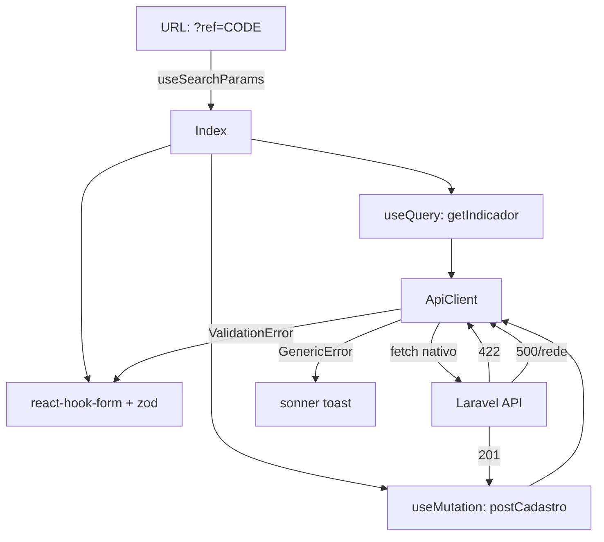

# Design Document — frontend-api-integration

## Visão Geral

Este documento descreve a arquitetura técnica para integrar o frontend React/TypeScript/Vite com a API REST Laravel já existente. O objetivo é substituir o mock com `setTimeout` em `src/pages/Index.tsx` por chamadas reais à API, adicionando tratamento de erros por campo, exibição dinâmica do indicador e configuração de ambiente.

O frontend utiliza as bibliotecas já instaladas: `react-hook-form` + `zod` para validação de formulário, `@tanstack/react-query` para gerenciamento de estado assíncrono, `sonner` para notificações e `react-router-dom` para leitura de query params.

---

## Arquitetura



### Decisões de Design

- **ApiClient como módulo puro**: funções simples que encapsulam `fetch`, sem estado. Facilita testes com mock de `fetch`.
- **react-hook-form com `setError`**: erros 422 da API são mapeados diretamente para os campos do formulário via `setError`, sem estado adicional.
- **React Query para o indicador**: `useQuery` com `enabled: !!refCode` garante que a busca só ocorre quando o parâmetro `ref` está presente. O estado de loading/error é gerenciado automaticamente.
- **`useMutation` para o cadastro**: gerencia o estado de loading do botão e o callback de sucesso/erro de forma declarativa.
- **Limpeza de whatsapp no payload**: a máscara visual fica no input; a limpeza de dígitos ocorre no momento de montar o payload, antes de chamar o ApiClient.
- **Sem biblioteca de máscara**: o campo whatsapp usa `onInput` para formatar visualmente, mas o valor enviado é sempre limpo de caracteres não-numéricos.

---

## Componentes e Interfaces

### Estrutura de Arquivos

```
src/
  lib/
    api.ts          # ApiClient: funções fetch + tipos TypeScript
  hooks/
    useCadastro.ts  # useMutation wrapper para postCadastro
    useIndicador.ts # useQuery wrapper para getIndicador
  pages/
    Index.tsx       # Página principal refatorada
```

### `src/lib/api.ts` — ApiClient

```typescript
const BASE_URL = import.meta.env.VITE_API_URL ?? "http://localhost:8000";

// Tipos
export interface CadastroPayload {
  nome: string;
  whatsapp: string;
  data_nascimento: string;
  endereco: string;
  cidade: string;
  email: string;
  lgpd_aceito: boolean;
  referral_code?: string;
}

export interface CadastroResponse {
  id: number;
  nome: string;
  cidade: string;
  referral_code: string;
  referral_link: string;
  lgpd_aceito_em: string;
  created_at: string;
}

export interface IndicadorData {
  nome: string;
  cidade: string;
}

export interface IndicadorResponse {
  data: Array<{ nome: string; cidade: string; data_cadastro: string }>;
}

export class ValidationError extends Error {
  constructor(public errors: Record<string, string[]>) {
    super("Validation failed");
  }
}

// Funções
export async function postCadastro(data: CadastroPayload): Promise<CadastroResponse>
export async function getIndicador(referralCode: string): Promise<IndicadorResponse>
```

**Lógica de tratamento de erros no ApiClient:**

1. Se `response.ok` → retorna `response.json()`
2. Se `response.status === 422` → lança `ValidationError` com `body.errors`
3. Se outro 4xx/5xx → lança `Error` com `body.message` ou mensagem genérica
4. Se `fetch` lança (rede) → captura e relança com mensagem de conectividade

### `src/hooks/useIndicador.ts`

```typescript
export function useIndicador(referralCode: string | null) {
  return useQuery({
    queryKey: ["indicador", referralCode],
    queryFn: () => getIndicador(referralCode!),
    enabled: !!referralCode,
    retry: false,
  });
}
```

### `src/hooks/useCadastro.ts`

```typescript
export function useCadastro() {
  return useMutation({
    mutationFn: postCadastro,
  });
}
```

### `src/pages/Index.tsx` — Refatoração

O componente `Index` passa a:

1. Ler `ref` via `useSearchParams()` do `react-router-dom`
2. Chamar `useIndicador(refCode)` para buscar dados do indicador
3. Usar `useForm<FormValues>` com schema `zod` para validação client-side
4. Usar `useCadastro()` para submeter o formulário
5. No `onSubmit`: limpar whatsapp, montar payload, chamar `mutateAsync`
6. No `onError`: se `ValidationError`, chamar `setError` para cada campo; senão, `toast.error`
7. Na tela de sucesso: exibir `referral_link` retornado pela API

**Schema Zod:**

```typescript
const schema = z.object({
  nome: z.string().min(1, "Nome é obrigatório"),
  whatsapp: z.string().min(10, "WhatsApp inválido"),
  data_nascimento: z.string().min(1, "Data de nascimento é obrigatória"),
  endereco: z.string().min(1, "Endereço é obrigatório"),
  cidade: z.string().min(1, "Cidade é obrigatória"),
  email: z.string().email("E-mail inválido"),
  lgpd_aceito: z.boolean().refine(v => v === true, "Aceite obrigatório"),
});
```

---

## Modelos de Dados

### Payload enviado — POST /api/cadastro

```typescript
{
  nome: string,           // ex: "João Silva"
  whatsapp: string,       // apenas dígitos: "61999999999"
  data_nascimento: string, // formato YYYY-MM-DD: "1990-05-20"
  endereco: string,       // ex: "QNM 38 Conjunto F, 12"
  cidade: string,         // ex: "Ceilândia (RA-09)"
  email: string,          // ex: "joao@email.com"
  lgpd_aceito: boolean,   // true
  referral_code?: string  // presente apenas se ?ref= na URL
}
```

### Resposta de sucesso — HTTP 201

```typescript
{
  id: number,
  nome: string,
  cidade: string,
  referral_code: string,   // 8 chars alfanuméricos
  referral_link: string,   // URL completa com ?ref=
  lgpd_aceito_em: string,  // ISO 8601
  created_at: string       // ISO 8601
}
```

### Resposta de erro — HTTP 422

```typescript
{
  message: string,
  errors: {
    [campo: string]: string[]
  }
}
```

### Dados do indicador — GET /api/usuarios/{referral_code}/indicados

```typescript
{
  data: Array<{
    nome: string,
    cidade: string,
    data_cadastro: string
  }>
}
// O indicador é o primeiro item da lista (ou o próprio dono do referral_code)
// Nota: o endpoint retorna os indicados; o nome/cidade do indicador
// vem do primeiro registro ou de um campo adicional a ser confirmado com a API.
// Design assume que a seção "Indicado por" exibe dados do primeiro item de `data`
// ou que a API retorna um campo `indicador` no response — a ser validado na implementação.
```

> **Nota de implementação**: O endpoint `GET /api/usuarios/{referral_code}/indicados` retorna a lista de pessoas indicadas por aquele código. Para exibir o nome do *dono* do referral_code (o indicador), pode ser necessário ajustar o endpoint ou usar os dados disponíveis. A implementação deve verificar o contrato real da API e adaptar conforme necessário.

---

## Propriedades de Correção

*Uma propriedade é uma característica ou comportamento que deve ser verdadeiro em todas as execuções válidas de um sistema — essencialmente, uma declaração formal sobre o que o sistema deve fazer. Propriedades servem como ponte entre especificações legíveis por humanos e garantias de correção verificáveis por máquina.*

### Propriedade 1: Headers obrigatórios presentes em todas as requisições

*Para qualquer* chamada ao ApiClient (tanto `postCadastro` quanto `getIndicador`), a requisição `fetch` deve incluir o header `Accept: application/json`; e para requisições POST, deve incluir também `Content-Type: application/json`.

**Validates: Requirements 2.2, 2.3**

---

### Propriedade 2: Erro 422 lança ValidationError com objeto errors

*Para qualquer* resposta HTTP 422 retornada pela API com um objeto `errors`, o ApiClient deve lançar uma instância de `ValidationError` cujo campo `errors` é idêntico ao objeto `errors` da resposta.

**Validates: Requirements 2.4**

---

### Propriedade 3: Erros não-422 lançam Error genérico

*Para qualquer* resposta HTTP com status 4xx ou 5xx diferente de 422, o ApiClient deve lançar um `Error` (não `ValidationError`) com uma mensagem não-vazia.

**Validates: Requirements 2.5**

---

### Propriedade 4: Payload do formulário contém todos os campos obrigatórios

*Para qualquer* submissão válida do formulário, o body da requisição `POST /api/cadastro` deve conter os campos `nome`, `whatsapp`, `data_nascimento`, `endereco`, `cidade`, `email` e `lgpd_aceito`.

**Validates: Requirements 3.1**

---

### Propriedade 5: WhatsApp enviado contém apenas dígitos

*Para qualquer* valor digitado no campo whatsapp (com ou sem formatação como parênteses, espaços e hífens), o valor enviado no payload deve conter exclusivamente caracteres numéricos.

**Validates: Requirements 3.2**

---

### Propriedade 6: Parâmetro ref controla presença de referral_code no payload

*Para qualquer* URL com parâmetro `?ref={code}`, o payload enviado deve incluir `referral_code` igual a `code`; e para qualquer URL sem o parâmetro `ref`, o payload não deve incluir o campo `referral_code`.

**Validates: Requirements 4.1, 4.2, 4.3**

---

### Propriedade 7: Presença de ref na URL dispara busca do indicador

*Para qualquer* valor de `referral_code` presente no parâmetro `ref` da URL, o hook `useIndicador` deve realizar a requisição `GET /api/usuarios/{referral_code}/indicados`; e quando o parâmetro `ref` está ausente, nenhuma requisição deve ser feita.

**Validates: Requirements 5.1, 5.5**

---

### Propriedade 8: Erros 422 são mapeados para campos do formulário

*Para qualquer* resposta 422 contendo um objeto `errors` com N chaves de campos, cada chave deve ser mapeada via `setError` do react-hook-form para o campo correspondente, exibindo a mensagem abaixo do campo correto no formulário.

**Validates: Requirements 6.1, 6.2, 6.3, 6.4**

---

### Propriedade 9: Botão de envio é reabilitado após qualquer erro

*Para qualquer* erro ocorrido durante a submissão do formulário (422, 500 ou falha de rede), o botão de envio deve retornar ao estado habilitado após o tratamento do erro.

**Validates: Requirements 7.3**

---

### Exemplo 1: Tela de sucesso exibe referral_link

Dado que a API retorna HTTP 201 com um `referral_link` válido, a tela de sucesso deve exibir esse link para o usuário.

**Validates: Requirements 3.4**

---

### Exemplo 2: Toast de sucesso exibido após HTTP 201

Dado que a API retorna HTTP 201, o componente deve chamar `toast.success` com uma mensagem de confirmação.

**Validates: Requirements 3.5**

---

### Exemplo 3: Seção "Indicado por" oculta sem parâmetro ref

Dado que a URL não contém o parâmetro `?ref=`, a seção "Indicado por" não deve ser renderizada.

**Validates: Requirements 5.5**

---

### Exemplo 4: Toast de erro exibido para HTTP 500

Dado que a API retorna HTTP 500, o componente deve chamar `toast.error` com uma mensagem amigável (sem stack trace).

**Validates: Requirements 7.1**

---

## Tratamento de Erros

### Mapeamento de Situações de Erro

| Situação | Comportamento no Frontend |
|----------|--------------------------|
| HTTP 201 | Exibe tela de sucesso com `referral_link`; toast de sucesso |
| HTTP 422 | `setError` por campo via react-hook-form; formulário mantido preenchido |
| HTTP 4xx/5xx (não 422) | `toast.error` com mensagem genérica amigável |
| Falha de rede | `toast.error` indicando problema de conectividade |
| Indicador 404 | Seção "Indicado por" oculta ou estado neutro |
| Indicador falha de rede | Seção "Indicado por" oculta ou estado neutro |

### Mensagens de Erro ao Usuário

- Erro de servidor: `"Ocorreu um erro ao enviar o cadastro. Tente novamente."`
- Falha de rede: `"Sem conexão com o servidor. Verifique sua internet e tente novamente."`
- Nunca expor: stack traces, mensagens técnicas internas, detalhes de implementação

### Configuração de Ambiente

```
# .env.example
VITE_API_URL=http://localhost:8000
```

```
# .env (desenvolvimento local)
VITE_API_URL=http://localhost:8000
```

---

## Estratégia de Testes

### Abordagem Dual

Os testes combinam **testes de unidade/exemplo** (comportamentos concretos e casos de borda) com **testes baseados em propriedades** (cobertura universal via geração aleatória de dados). Ambos são complementares.

**Biblioteca de testes**: Vitest + @testing-library/react (já configurados)
**Biblioteca PBT**: `fast-check` — biblioteca de property-based testing para TypeScript/JavaScript

### Testes de Unidade e Exemplo (Vitest)

Localização: `src/lib/__tests__/api.test.ts`, `src/pages/__tests__/Index.test.tsx`

**ApiClient (`api.test.ts`)**:
- Verifica que `postCadastro` chama `fetch` com URL correta
- Verifica que resposta 201 retorna o objeto correto
- Verifica que resposta 422 lança `ValidationError` com `errors` correto
- Verifica que resposta 500 lança `Error` genérico
- Verifica que falha de rede lança erro com mensagem de conectividade (edge case)
- Verifica fallback para `http://localhost:8000` quando `VITE_API_URL` não definido (edge case)

**Index.tsx (`Index.test.tsx`)**:
- Seção "Indicado por" não renderizada sem parâmetro `ref` (Exemplo 3)
- Tela de sucesso exibe `referral_link` após HTTP 201 (Exemplo 1)
- `toast.success` chamado após HTTP 201 (Exemplo 2)
- `toast.error` chamado após HTTP 500 (Exemplo 4)
- Formulário mantém valores após erro 422 (Req 6.5)
- Estado de loading do botão durante submissão (Req 3.6)
- Dados do indicador exibidos quando API retorna dados (Req 5.2)
- Estado de loading na seção indicador (Req 5.3)

### Testes Baseados em Propriedades (Vitest + fast-check)

Localização: `src/lib/__tests__/api.property.test.ts`, `src/pages/__tests__/Index.property.test.tsx`

Configuração: mínimo de **100 iterações** por propriedade (padrão do fast-check).

Cada teste deve referenciar a propriedade do design com o formato:
`Feature: frontend-api-integration, Property {N}: {texto da propriedade}`

```typescript
import * as fc from "fast-check";

// Feature: frontend-api-integration, Property 5: WhatsApp enviado contém apenas dígitos
it("whatsapp enviado contém apenas dígitos", () => {
  fc.assert(
    fc.property(
      fc.string({ minLength: 10, maxLength: 11 }).map(s => s.replace(/\D/g, "").padEnd(10, "0")),
      fc.array(fc.constantFrom("(", ")", " ", "-", ".")),
      (digits, separators) => {
        const formatted = /* aplica separadores */ digits;
        const cleaned = formatted.replace(/\D/g, "");
        expect(cleaned).toMatch(/^\d+$/);
      }
    ),
    { numRuns: 100 }
  );
});
```

### Cobertura por Propriedade

| Propriedade | Tipo de Teste | Arquivo |
|-------------|---------------|---------|
| P1 — Headers obrigatórios | Property | `api.property.test.ts` |
| P2 — 422 lança ValidationError | Property | `api.property.test.ts` |
| P3 — Erros não-422 lançam Error genérico | Property | `api.property.test.ts` |
| P4 — Payload contém todos os campos | Property | `Index.property.test.tsx` |
| P5 — WhatsApp apenas dígitos | Property | `api.property.test.ts` |
| P6 — ref controla referral_code no payload | Property | `Index.property.test.tsx` |
| P7 — ref dispara busca do indicador | Property | `Index.property.test.tsx` |
| P8 — 422 mapeado para campos do formulário | Property | `Index.property.test.tsx` |
| P9 — Botão reabilitado após erro | Property | `Index.property.test.tsx` |
| E1 — Tela de sucesso exibe referral_link | Example | `Index.test.tsx` |
| E2 — Toast de sucesso após 201 | Example | `Index.test.tsx` |
| E3 — Seção indicador oculta sem ref | Example | `Index.test.tsx` |
| E4 — Toast de erro após 500 | Example | `Index.test.tsx` |
