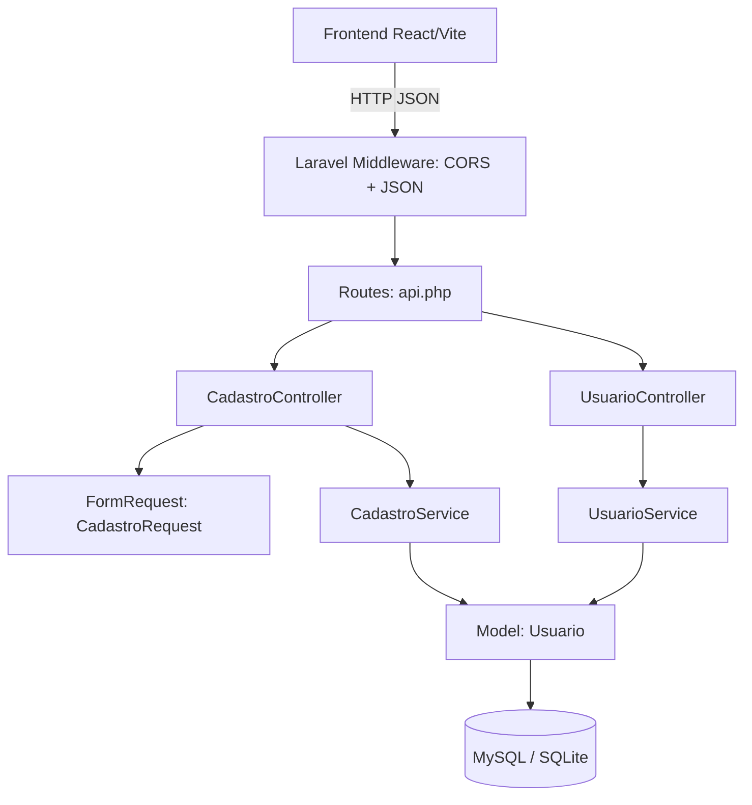

# Design Document — laravel-cadastro-api

## Visão Geral

Este documento descreve a arquitetura e o design técnico do backend em Laravel 10 que suporta o frontend de cadastro (React/TypeScript/Vite). A API REST expõe dois endpoints principais: criação de usuário com geração automática de referral code e consulta de indicados por referral code. O sistema é stateless, retorna JSON em todas as respostas e é configurado para aceitar requisições CORS do domínio do frontend.

---

## Arquitetura

O backend segue a arquitetura MVC padrão do Laravel, com uma camada de serviço para isolar a lógica de negócio (geração de referral code, rastreamento de indicações) dos controllers.



### Decisões de Design

- **Camada de serviço**: `CadastroService` e `UsuarioService` encapsulam a lógica de negócio, mantendo os controllers finos e testáveis.
- **FormRequest para validação**: `CadastroRequest` centraliza todas as regras de validação, aproveitando o mecanismo nativo do Laravel que retorna HTTP 422 automaticamente.
- **Geração de referral code no serviço**: a lógica de retry para unicidade fica isolada em `CadastroService::generateUniqueReferralCode()`.
- **Soft deletes não utilizados**: o escopo do projeto não exige exclusão lógica; registros são permanentes.
- **Autenticação**: os endpoints são públicos (sem autenticação) conforme os requisitos — o endpoint de indicados é de consulta gerencial sem dados sensíveis.

---

## Componentes e Interfaces

### Rotas (`routes/api.php`)

| Método | URI | Controller@método | Descrição |
|--------|-----|-------------------|-----------|
| POST | `/api/cadastro` | `CadastroController@store` | Cria novo usuário |
| GET | `/api/usuarios/{referral_code}/indicados` | `UsuarioController@indicados` | Lista indicados |
| OPTIONS | `/api/*` | (middleware CORS) | Preflight CORS |

### CadastroController

```
store(CadastroRequest $request): JsonResponse
```

- Delega validação ao `CadastroRequest`
- Chama `CadastroService::cadastrar(array $data): Usuario`
- Retorna HTTP 201 com o recurso criado incluindo `referral_link`

### CadastroRequest (FormRequest)

Regras de validação:

| Campo | Regras |
|-------|--------|
| `nome` | required, string, max:255 |
| `whatsapp` | required, string, digits, between:10,11, unique:usuarios |
| `data_nascimento` | required, date_format:Y-m-d, before_or_equal:today |
| `endereco` | required, string, max:500 |
| `cidade` | required, string, max:255 |
| `email` | required, email, max:255, unique:usuarios |
| `lgpd_aceito` | required, accepted |
| `referral_code` | nullable, string, size:8, exists:usuarios,referral_code |

### CadastroService

```
cadastrar(array $data): Usuario
generateUniqueReferralCode(): string   // loop até unicidade
```

- `generateUniqueReferralCode`: gera string alfanumérica de 8 chars com `Str::random(8)`, verifica unicidade na tabela `usuarios`, repete até encontrar valor único.
- Converte `lgpd_aceito: true` → `lgpd_aceito_em: now()`.
- Resolve `indicador_id` a partir do `referral_code` recebido (se presente).
- Monta `referral_link` = `config('app.url') . '/cadastro?ref=' . $referral_code`.

### UsuarioController

```
indicados(string $referral_code): JsonResponse
```

- Busca o usuário dono do `referral_code`; retorna 404 se não encontrado.
- Retorna lista de indicados com campos `nome`, `cidade`, `data_cadastro`.

### UsuarioService

```
getIndicados(string $referral_code): Collection
```

- Usa Eloquent relationship `hasMany` para buscar indicados.

---

## Modelos de Dados

### Tabela `usuarios`

| Coluna | Tipo | Restrições | Descrição |
|--------|------|------------|-----------|
| `id` | BIGINT UNSIGNED | PK, auto-increment | Identificador interno |
| `nome` | VARCHAR(255) | NOT NULL | Nome completo |
| `whatsapp` | VARCHAR(11) | NOT NULL, UNIQUE | Número sem formatação |
| `data_nascimento` | DATE | NOT NULL | Data de nascimento |
| `endereco` | VARCHAR(500) | NOT NULL | Endereço completo |
| `cidade` | VARCHAR(255) | NOT NULL | Cidade |
| `email` | VARCHAR(255) | NOT NULL, UNIQUE | E-mail |
| `referral_code` | CHAR(8) | NOT NULL, UNIQUE | Código de indicação gerado |
| `indicador_id` | BIGINT UNSIGNED | NULL, FK → usuarios.id | Quem indicou |
| `lgpd_aceito_em` | TIMESTAMP | NOT NULL | Data/hora do aceite LGPD |
| `created_at` | TIMESTAMP | NOT NULL | Criado em |
| `updated_at` | TIMESTAMP | NOT NULL | Atualizado em |

### Model Eloquent `Usuario`

```php
class Usuario extends Model
{
    protected $table = 'usuarios';

    protected $fillable = [
        'nome', 'whatsapp', 'data_nascimento', 'endereco',
        'cidade', 'email', 'referral_code', 'indicador_id', 'lgpd_aceito_em',
    ];

    protected $hidden = ['whatsapp', 'email', 'indicador_id', 'updated_at'];

    // Relacionamentos
    public function indicador(): BelongsTo  // quem me indicou
    public function indicados(): HasMany    // quem eu indiquei
}
```

### Resposta HTTP 201 — POST /api/cadastro

```json
{
  "id": 42,
  "nome": "João Silva",
  "cidade": "Brasília",
  "referral_code": "AB12CD34",
  "referral_link": "https://app.example.com/cadastro?ref=AB12CD34",
  "lgpd_aceito_em": "2024-01-15T10:30:00Z",
  "created_at": "2024-01-15T10:30:00Z"
}
```

### Resposta HTTP 200 — GET /api/usuarios/{referral_code}/indicados

```json
{
  "data": [
    {
      "nome": "Maria Souza",
      "cidade": "Taguatinga",
      "data_cadastro": "2024-01-16T08:00:00Z"
    }
  ]
}
```

### Resposta HTTP 422 — Erros de Validação

```json
{
  "message": "The given data was invalid.",
  "errors": {
    "email": ["O e-mail já está cadastrado."],
    "whatsapp": ["O WhatsApp já está cadastrado."]
  }
}
```

---

## Propriedades de Correção

*Uma propriedade é uma característica ou comportamento que deve ser verdadeiro em todas as execuções válidas de um sistema — essencialmente, uma declaração formal sobre o que o sistema deve fazer. Propriedades servem como ponte entre especificações legíveis por humanos e garantias de correção verificáveis por máquina.*

---

### Propriedade 1: Cadastro válido produz referral_code e referral_link corretos

*Para qualquer* conjunto de dados de cadastro válidos (nome, whatsapp, data_nascimento, endereço, cidade, email, lgpd_aceito=true), a API deve retornar HTTP 201 com um `referral_code` de exatamente 8 caracteres alfanuméricos e um `referral_link` no formato `{APP_URL}/cadastro?ref={referral_code}`.

**Validates: Requirements 1.1, 3.1, 3.3**

---

### Propriedade 2: Campos únicos duplicados retornam HTTP 422

*Para qualquer* usuário já cadastrado, ao tentar cadastrar outro usuário com o mesmo `email` ou o mesmo `whatsapp`, a API deve retornar HTTP 422 com mensagem de erro identificando o campo duplicado.

**Validates: Requirements 1.3, 1.4**

---

### Propriedade 3: lgpd_aceito ausente ou falso retorna HTTP 422

*Para qualquer* requisição de cadastro onde `lgpd_aceito` seja `false`, `0`, ou esteja ausente, a API deve retornar HTTP 422 com erro indicando que o aceite dos termos é obrigatório.

**Validates: Requirements 1.5**

---

### Propriedade 4: Dados de entrada inválidos retornam HTTP 422 com erros por campo

*Para qualquer* requisição de cadastro contendo ao menos um campo inválido (nome vazio, whatsapp com letras ou fora de 10-11 dígitos, data_nascimento futura ou mal formatada, endereço vazio, cidade vazia, email mal formatado), a API deve retornar HTTP 422 com um objeto JSON onde cada chave corresponde ao campo inválido e o valor é uma lista de mensagens de erro.

**Validates: Requirements 2.1, 2.2, 2.3, 2.4, 2.5, 2.6, 2.7**

---

### Propriedade 5: Unicidade do referral_code entre todos os usuários

*Para qualquer* conjunto de N usuários cadastrados com sucesso, todos os `referral_code` devem ser distintos entre si.

**Validates: Requirements 3.2**

---

### Propriedade 6: Indicador associado corretamente quando referral_code válido é fornecido

*Para qualquer* usuário A existente no banco, ao cadastrar um usuário B informando o `referral_code` de A, o registro de B deve ter `indicador_id` igual ao `id` de A.

**Validates: Requirements 4.1, 4.4**

---

### Propriedade 7: referral_code inválido no cadastro retorna HTTP 422

*Para qualquer* string de 8 caracteres que não corresponda ao `referral_code` de nenhum usuário existente, ao enviá-la no campo `referral_code` do cadastro, a API deve retornar HTTP 422 com mensagem de erro indicando código de indicação inválido.

**Validates: Requirements 4.2**

---

### Propriedade 8: Cadastro sem referral_code resulta em indicador_id nulo

*Para qualquer* cadastro válido que não inclua o campo `referral_code`, o registro criado deve ter `indicador_id` igual a `null`.

**Validates: Requirements 4.3**

---

### Propriedade 9: Consulta de indicados retorna lista com campos corretos e sem dados sensíveis

*Para qualquer* usuário com N indicados (N ≥ 0), a resposta de GET `/api/usuarios/{referral_code}/indicados` deve retornar HTTP 200 com uma lista de N objetos, cada um contendo exatamente os campos `nome`, `cidade` e `data_cadastro`, sem expor `whatsapp`, `email` ou outros dados sensíveis.

**Validates: Requirements 5.1, 5.3, 5.4, 7.2**

---

### Propriedade 10: referral_code inexistente na consulta retorna HTTP 404

*Para qualquer* string que não corresponda ao `referral_code` de nenhum usuário existente, a requisição GET `/api/usuarios/{referral_code}/indicados` deve retornar HTTP 404.

**Validates: Requirements 5.2**

---

### Propriedade 11: lgpd_aceito_em preenchido no momento do cadastro

*Para qualquer* cadastro realizado com `lgpd_aceito=true`, o campo `lgpd_aceito_em` no banco de dados deve conter um timestamp dentro de um intervalo razoável do momento da requisição (ex: ± 5 segundos).

**Validates: Requirements 7.1**

---

### Exemplo 1: Preflight CORS retorna HTTP 200 com headers corretos

Uma requisição OPTIONS para qualquer rota `/api/*` com o header `Origin: {FRONTEND_URL}` deve retornar HTTP 200 com os headers `Access-Control-Allow-Origin`, `Access-Control-Allow-Methods` e `Access-Control-Allow-Headers` presentes.

**Validates: Requirements 6.1, 6.4**

---

## Tratamento de Erros

### Estratégia Geral

O Laravel retorna automaticamente HTTP 422 quando um `FormRequest` falha na validação. O `Handler` de exceções é configurado para retornar sempre JSON.

### Mapeamento de Erros

| Situação | HTTP Status | Estrutura da Resposta |
|----------|-------------|----------------------|
| Validação falhou | 422 | `{ "message": "...", "errors": { campo: [msgs] } }` |
| referral_code não encontrado (GET indicados) | 404 | `{ "message": "Código de indicação não encontrado." }` |
| Erro interno do servidor | 500 | `{ "message": "Erro interno do servidor." }` |
| Rota não encontrada | 404 | `{ "message": "Rota não encontrada." }` |
| Método não permitido | 405 | `{ "message": "Método não permitido." }` |

### Configuração do Handler (`app/Exceptions/Handler.php`)

```php
// Garantir que todas as respostas sejam JSON para rotas de API
$this->renderable(function (ValidationException $e, $request) {
    if ($request->is('api/*')) {
        return response()->json([
            'message' => $e->getMessage(),
            'errors'  => $e->errors(),
        ], 422);
    }
});

$this->renderable(function (ModelNotFoundException $e, $request) {
    if ($request->is('api/*')) {
        return response()->json(['message' => 'Recurso não encontrado.'], 404);
    }
});
```

### Configuração CORS (`config/cors.php`)

```php
return [
    'paths'         => ['api/*'],
    'allowed_origins' => [env('FRONTEND_URL', 'http://localhost:5173')],
    'allowed_methods' => ['GET', 'POST', 'OPTIONS'],
    'allowed_headers' => ['Content-Type', 'Accept', 'X-Requested-With'],
    'exposed_headers' => [],
    'max_age'         => 0,
    'supports_credentials' => false,
];
```

---

## Estratégia de Testes

### Abordagem Dual

Os testes combinam **testes de unidade/feature** (exemplos concretos e casos de borda) com **testes baseados em propriedades** (cobertura universal via geração aleatória de dados). Ambos são complementares e necessários.

### Testes de Feature (PHPUnit)

Localização: `tests/Feature/`

- `CadastroTest.php`: testa o endpoint POST `/api/cadastro`
  - Cadastro bem-sucedido retorna 201 com estrutura correta
  - Email duplicado retorna 422
  - WhatsApp duplicado retorna 422
  - lgpd_aceito ausente retorna 422
  - Cada campo inválido retorna 422 com chave correta no objeto de erros
  - Cadastro com referral_code válido associa indicador_id
  - Cadastro com referral_code inválido retorna 422
  - Cadastro sem referral_code cria usuário com indicador_id null
  - Preflight OPTIONS retorna 200 com headers CORS

- `IndicadosTest.php`: testa o endpoint GET `/api/usuarios/{referral_code}/indicados`
  - Usuário com indicados retorna 200 com lista correta
  - Usuário sem indicados retorna 200 com lista vazia
  - referral_code inexistente retorna 404
  - Resposta não expõe whatsapp nem email

### Testes de Unidade (PHPUnit)

Localização: `tests/Unit/`

- `CadastroServiceTest.php`
  - `generateUniqueReferralCode` retorna string de 8 chars alfanuméricos
  - `generateUniqueReferralCode` nunca retorna código já existente no banco

### Testes Baseados em Propriedades (PHPUnit + Eris)

Biblioteca: **[Eris](https://github.com/giorgiosironi/eris)** (biblioteca PBT para PHP/PHPUnit)

Localização: `tests/Property/`

Configuração: mínimo de **100 iterações** por propriedade.

Cada teste deve referenciar a propriedade do design com o formato:
`Feature: laravel-cadastro-api, Property {N}: {texto da propriedade}`

```php
// Exemplo de estrutura
use Eris\TestTrait;

class CadastroPropertyTest extends TestCase
{
    use TestTrait;

    /**
     * Feature: laravel-cadastro-api, Property 1: Cadastro válido produz referral_code e referral_link corretos
     */
    public function test_cadastro_valido_gera_referral_code_e_link(): void
    {
        $this->forAll(
            Generator\validCadastroData()  // gerador customizado
        )->then(function (array $data) {
            $response = $this->postJson('/api/cadastro', $data);
            $response->assertStatus(201);
            $this->assertMatchesRegularExpression('/^[A-Za-z0-9]{8}$/', $response->json('referral_code'));
            $this->assertStringContainsString('?ref=' . $response->json('referral_code'), $response->json('referral_link'));
        });
    }
}
```

### Cobertura por Propriedade

| Propriedade | Tipo de Teste | Arquivo |
|-------------|---------------|---------|
| P1 — Cadastro válido | Property | `CadastroPropertyTest` |
| P2 — Campos únicos duplicados | Property | `CadastroPropertyTest` |
| P3 — lgpd_aceito falso/ausente | Property | `CadastroPropertyTest` |
| P4 — Dados inválidos → 422 por campo | Property | `CadastroPropertyTest` |
| P5 — Unicidade do referral_code | Property | `CadastroServicePropertyTest` |
| P6 — Indicador associado | Property | `CadastroPropertyTest` |
| P7 — referral_code inválido → 422 | Property | `CadastroPropertyTest` |
| P8 — Sem referral_code → indicador_id null | Property | `CadastroPropertyTest` |
| P9 — Indicados: campos corretos, sem dados sensíveis | Property | `IndicadosPropertyTest` |
| P10 — referral_code inexistente → 404 | Property | `IndicadosPropertyTest` |
| P11 — lgpd_aceito_em preenchido | Property | `CadastroPropertyTest` |
| E1 — Preflight CORS | Example | `CadastroTest` |
