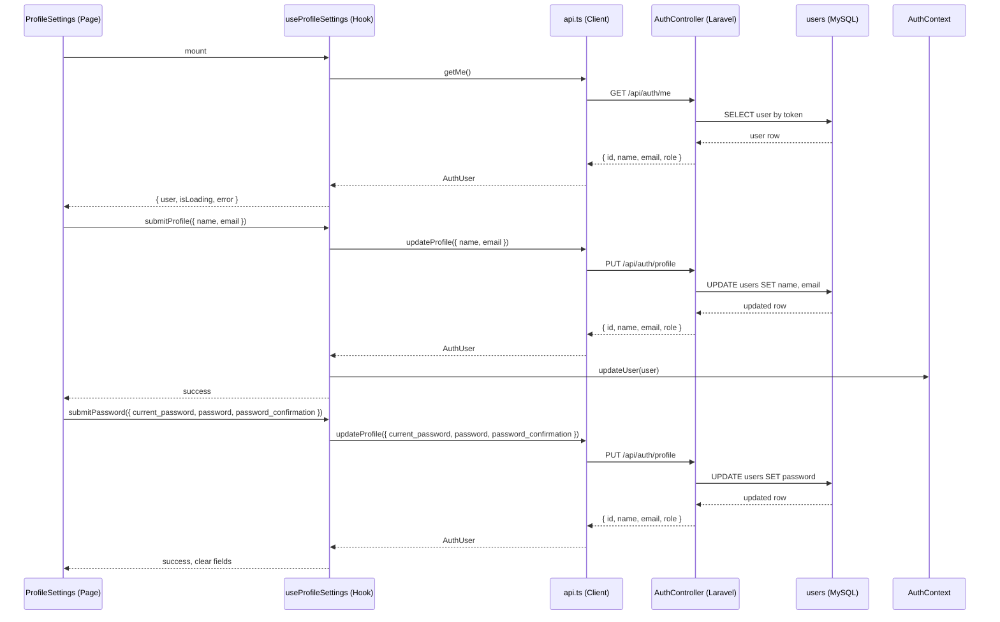

# Design Document — user-profile-settings

## Overview

Esta feature adiciona uma página de configurações de perfil ao painel, acessível por qualquer usuário autenticado (admin ou lider). O usuário pode visualizar e editar seu nome e e-mail, além de alterar sua senha. A implementação segue os padrões já estabelecidos no projeto: hook customizado para lógica de dados, componente de página para UI, FormRequest no backend para validação, e método no AuthController para o novo endpoint.

Não há necessidade de novo modelo ou migração — o modelo `User` já possui os campos `name`, `email` e `password` com os fillables corretos.

## Architecture



## Components and Interfaces

### Backend

**`UpdateProfileRequest`** — `app/Http/Requests/UpdateProfileRequest.php`

FormRequest com as regras de validação para o endpoint `PUT /api/auth/profile`. Valida os campos opcionais de dados pessoais e os campos condicionais de senha.

**`AuthController::updateProfile()`** — método adicionado ao `AuthController` existente

Processa a atualização de perfil do usuário autenticado. Aplica as mudanças de nome/email e/ou senha conforme os campos enviados.

**Rota** — adicionada ao grupo `auth:sanctum` em `routes/api.php`:
```
PUT /api/auth/profile → AuthController@updateProfile
```

### Frontend

**`updateProfile()`** — nova função em `src/lib/api.ts`

Chama `PUT /api/auth/profile` via `authFetch`. Aceita um payload parcial com os campos de perfil e/ou senha.

**`useProfileSettings`** — `src/hooks/useProfileSettings.ts`

Hook que encapsula o estado e a lógica da página: carregamento dos dados via `getMe()`, submissão do formulário de perfil, submissão do formulário de senha, e atualização do `AuthContext` após sucesso.

**`ProfileSettings`** — `src/pages/painel/ProfileSettings.tsx`

Página com dois formulários separados: um para nome/email e outro para alteração de senha. Usa os componentes `ui/` existentes (Input, Button, Card, Label). Acessível via rota `/painel/perfil` para ambos os roles.

**`AuthContext`** — adição de `updateUser` ao contexto

O `AuthContextValue` ganha um método `updateUser(user: AuthUser): void` para que o hook possa sincronizar o estado local após uma atualização bem-sucedida.

## Data Models

### Payload de atualização de perfil (Frontend → API)

```typescript
// Campos de dados pessoais (sem senha)
interface UpdateProfilePayload {
  name?: string;
  email?: string;
  current_password?: string;
  password?: string;
  password_confirmation?: string;
}

// Resposta da API (igual ao AuthUser existente)
interface AuthUser {
  id: number;
  name: string;
  email: string;
  role: "admin" | "lider";
}
```

### Validação no backend (UpdateProfileRequest)

| Campo | Regra |
|---|---|
| `name` | `sometimes`, `required_without_all:password,...`, `string`, `max:255` |
| `email` | `sometimes`, `string`, `email`, `max:255`, `unique:users,email,{id}` |
| `current_password` | `required_with:password`, `string` |
| `password` | `sometimes`, `string`, `min:8`, `confirmed` |
| `password_confirmation` | presente quando `password` é enviado |

A regra `password.confirmed` do Laravel valida automaticamente que `password_confirmation` é igual a `password`.

### Estado do hook `useProfileSettings`

```typescript
interface UseProfileSettingsResult {
  user: AuthUser | null;
  isLoading: boolean;
  loadError: string | null;
  profileForm: { name: string; email: string };
  setProfileForm: (v: { name: string; email: string }) => void;
  profileStatus: "idle" | "loading" | "success" | "error";
  profileError: string | null;
  submitProfile: () => Promise<void>;
  passwordForm: { current_password: string; password: string; password_confirmation: string };
  setPasswordForm: (v: { ... }) => void;
  passwordStatus: "idle" | "loading" | "success" | "error";
  passwordError: string | null;
  submitPassword: () => Promise<void>;
}
```

## Correctness Properties

*A property is a characteristic or behavior that should hold true across all valid executions of a system — essentially, a formal statement about what the system should do. Properties serve as the bridge between human-readable specifications and machine-verifiable correctness guarantees.*

### Property 1: Dados do perfil exibidos correspondem ao usuário autenticado

*Para qualquer* usuário autenticado (com qualquer nome e e-mail), quando a página de configurações de perfil é renderizada, os valores exibidos nos campos de nome e e-mail devem ser exatamente os valores retornados pelo endpoint `GET /api/auth/me`.

**Validates: Requirements 1.1, 1.2**

---

### Property 2: Atualização de dados pessoais retorna os dados atualizados

*Para qualquer* combinação válida de nome (não vazio) e e-mail (formato válido, único), a API deve retornar HTTP 200 com um objeto contendo `id`, `name`, `email` e `role` refletindo os novos valores enviados.

**Validates: Requirements 2.1, 4.6**

---

### Property 3: Nome vazio é rejeitado pela API

*Para qualquer* string vazia ou composta apenas de espaços enviada como `name`, a API deve retornar HTTP 422 com erros de validação.

**Validates: Requirements 2.3**

---

### Property 4: E-mail inválido é rejeitado pela API

*Para qualquer* string que não seja um endereço de e-mail válido enviada como `email`, a API deve retornar HTTP 422 com erros de validação.

**Validates: Requirements 2.4**

---

### Property 5: Sucesso na atualização de perfil sincroniza o AuthContext

*Para qualquer* atualização bem-sucedida de nome e/ou e-mail, o estado `user` no `AuthContext` deve refletir os novos valores imediatamente após a resposta da API.

**Validates: Requirements 2.6**

---

### Property 6: Alteração de senha com dados válidos retorna HTTP 200

*Para qualquer* senha atual correta e nova senha com 8 ou mais caracteres (com confirmação idêntica), a API deve retornar HTTP 200.

**Validates: Requirements 3.1**

---

### Property 7: Nova senha com menos de 8 caracteres é rejeitada

*Para qualquer* string com menos de 8 caracteres enviada como `password`, a API deve retornar HTTP 422 com erros de validação.

**Validates: Requirements 3.3**

---

### Property 8: Confirmação de senha diferente da nova senha é rejeitada

*Para qualquer* par de strings distintas enviadas como `password` e `password_confirmation`, a API deve retornar HTTP 422 com erros de validação.

**Validates: Requirements 3.4**

---

### Property 9: Campos de senha são limpos após alteração bem-sucedida

*Para qualquer* alteração de senha bem-sucedida, os campos `current_password`, `password` e `password_confirmation` do formulário devem ser esvaziados após a resposta da API.

**Validates: Requirements 3.5**

---

### Property 10: Atualização de perfil afeta apenas o usuário autenticado

*Para qualquer* dois usuários distintos, atualizar o perfil de um usuário não deve alterar os dados do outro usuário no banco de dados.

**Validates: Requirements 4.2**

---

### Property 11: Atualização de dados pessoais não exige campos de senha

*Para qualquer* payload contendo apenas `name` e/ou `email` (sem nenhum campo de senha), a API deve processar a requisição com sucesso sem exigir `current_password`.

**Validates: Requirements 4.4**

---

### Property 12: Envio parcial de campos de senha é rejeitado

*Para qualquer* payload que contenha pelo menos um campo de senha (`current_password`, `password` ou `password_confirmation`) mas não todos os três, a API deve retornar HTTP 422.

**Validates: Requirements 4.5**

## Error Handling

### Frontend

- **Falha ao carregar perfil** (Req 1.3): o hook expõe `loadError`; a página exibe mensagem de erro com botão de retry.
- **Erro de validação 422**: o `handleResponse` existente em `api.ts` lança `ValidationError` com o objeto `errors`; o hook mapeia os erros para os campos correspondentes.
- **Erro genérico de rede/servidor**: o hook captura qualquer `Error` e expõe via `profileError` / `passwordError`.
- **Token expirado (401)**: o `authFetch` existente já dispara o evento `auth:expired`, que o `AuthContext` trata redirecionando para `/login`.

### Backend

- **Validação falha**: o `UpdateProfileRequest` retorna automaticamente HTTP 422 com o objeto `errors` no formato padrão do Laravel.
- **Senha atual incorreta**: o controller verifica com `Hash::check()` e retorna HTTP 422 com mensagem específica.
- **E-mail duplicado**: a regra `unique:users,email,{id}` do FormRequest retorna HTTP 422 automaticamente.
- **Usuário não autenticado**: o middleware `auth:sanctum` retorna HTTP 401 antes de chegar ao controller.

## Testing Strategy

### Abordagem dual: testes unitários + testes baseados em propriedades

Os testes unitários cobrem exemplos específicos, casos de borda e integrações entre componentes. Os testes de propriedade verificam invariantes universais com entradas geradas aleatoriamente. Ambos são complementares e necessários.

### Testes unitários (Frontend — Vitest + Testing Library)

Localização: `src/hooks/__tests__/useProfileSettings.test.ts` e `src/pages/__tests__/ProfileSettings.test.tsx`

- Renderização dos dados do usuário nos campos do formulário
- Exibição de mensagem de erro quando `GET /api/auth/me` falha
- Exibição de mensagem de sucesso após atualização de perfil
- Exibição de mensagem de sucesso e limpeza dos campos após alteração de senha
- Exibição de erros de validação retornados pela API (422)
- Chamada ao endpoint correto (`PUT /api/auth/profile`) com o payload correto

### Testes de propriedade (Frontend — Vitest + fast-check)

Localização: `src/hooks/__tests__/useProfileSettings.property.test.ts`

Biblioteca: **fast-check** (já utilizada no projeto)

Configuração: mínimo de **100 iterações** por propriedade.

```
// Feature: user-profile-settings, Property 1: Dados do perfil exibidos correspondem ao usuário autenticado
// Feature: user-profile-settings, Property 5: Sucesso na atualização de perfil sincroniza o AuthContext
// Feature: user-profile-settings, Property 9: Campos de senha são limpos após alteração bem-sucedida
```

### Testes de propriedade (Backend — PHPUnit + Eris)

Localização: `tests/Property/ProfileSettingsTest.php`

Biblioteca: **Eris** (já presente em `vendor/giorgiosironi/eris`)

Configuração: mínimo de **100 iterações** por propriedade.

```
// Feature: user-profile-settings, Property 2: Atualização de dados pessoais retorna os dados atualizados
// Feature: user-profile-settings, Property 3: Nome vazio é rejeitado pela API
// Feature: user-profile-settings, Property 4: E-mail inválido é rejeitado pela API
// Feature: user-profile-settings, Property 6: Alteração de senha com dados válidos retorna HTTP 200
// Feature: user-profile-settings, Property 7: Nova senha com menos de 8 caracteres é rejeitada
// Feature: user-profile-settings, Property 8: Confirmação de senha diferente da nova senha é rejeitada
// Feature: user-profile-settings, Property 10: Atualização de perfil afeta apenas o usuário autenticado
// Feature: user-profile-settings, Property 11: Atualização de dados pessoais não exige campos de senha
// Feature: user-profile-settings, Property 12: Envio parcial de campos de senha é rejeitado
```

### Testes de feature (Backend — PHPUnit Feature Tests)

Localização: `tests/Feature/ProfileSettingsTest.php`

- `GET /api/auth/me` retorna os dados corretos do usuário autenticado
- `PUT /api/auth/profile` sem autenticação retorna 401
- `PUT /api/auth/profile` com e-mail duplicado retorna 422
- `PUT /api/auth/profile` com senha atual incorreta retorna 422
- Caso de borda: e-mail igual ao atual do próprio usuário não deve ser rejeitado como duplicado
